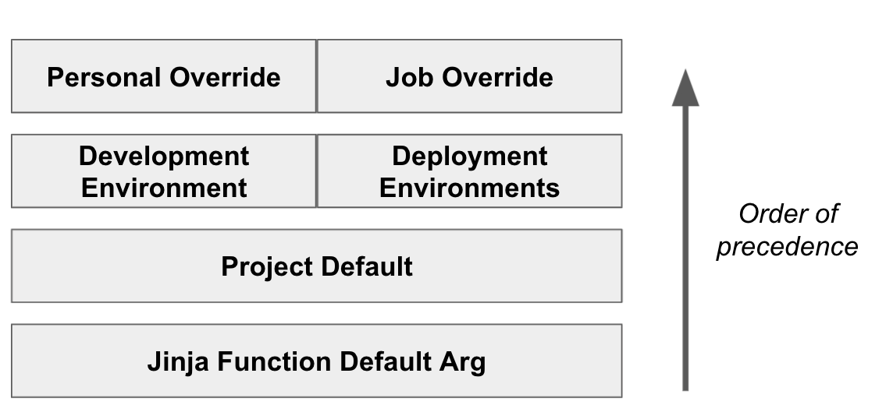
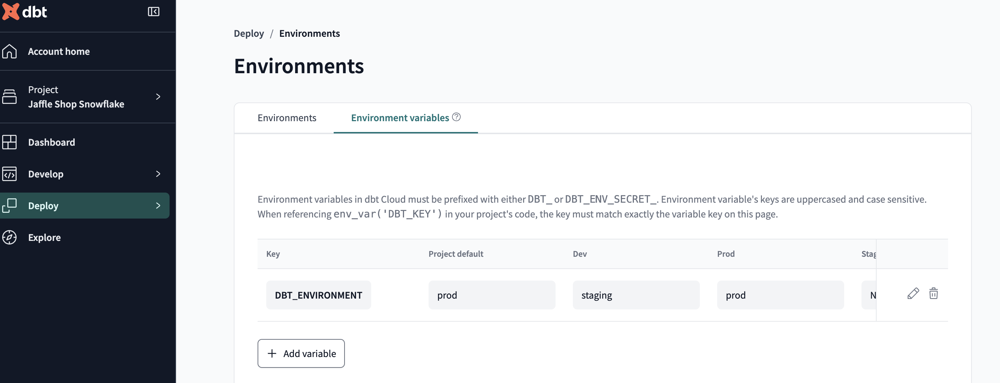

## Module 4 Homework

For this homework, you will need the following datasets:
* [Green Taxi dataset (2019 and 2020)](https://github.com/DataTalksClub/nyc-tlc-data/releases/tag/green)
* [Yellow Taxi dataset (2019 and 2020)](https://github.com/DataTalksClub/nyc-tlc-data/releases/tag/yellow)
* [For Hire Vehicle dataset (2019)](https://github.com/DataTalksClub/nyc-tlc-data/releases/tag/fhv)

### Before you start

1. Make sure you, **at least**, have them in GCS with a External Table **OR** a Native Table - use whichever method you prefer to accomplish that (Workflow Orchestration with [pandas-gbq](https://cloud.google.com/bigquery/docs/samples/bigquery-pandas-gbq-to-gbq-simple), [dlt for gcs](https://dlthub.com/docs/dlt-ecosystem/destinations/filesystem), [dlt for BigQuery](https://dlthub.com/docs/dlt-ecosystem/destinations/bigquery), [gsutil](https://cloud.google.com/storage/docs/gsutil), etc)
2. You should have exactly `7,778,101` records in your Green Taxi table
3. You should have exactly `109,047,518` records in your Yellow Taxi table
4. You should have exactly `43,244,696` records in your FHV table
5. Build the staging models for green/yellow as shown in [here](../../../04-analytics-engineering/taxi_rides_ny/models/staging/)
6. Build the dimension/fact for taxi_trips joining with `dim_zones`  as shown in [here](../../../04-analytics-engineering/taxi_rides_ny/models/core/fact_trips.sql)


### Question 1: Understanding dbt model resolution

Provided you've got the following sources.yaml
```yaml
version: 2

sources:
  - name: raw_nyc_tripdata
    database: "{{ env_var('DBT_BIGQUERY_PROJECT', 'dtc_zoomcamp_2025') }}"
    schema:   "{{ env_var('DBT_BIGQUERY_SOURCE_DATASET', 'raw_nyc_tripdata') }}"
    tables:
      - name: ext_green_taxi
      - name: ext_yellow_taxi
```

with the following env variables setup where `dbt` runs:
```shell
export DBT_BIGQUERY_PROJECT=myproject
export DBT_BIGQUERY_DATASET=my_nyc_tripdata
```

What does this .sql model compile to?
```sql
select * 
from {{ source('raw_nyc_tripdata', 'ext_green_taxi' ) }}
```

- `select * from dtc_zoomcamp_2025.raw_nyc_tripdata.ext_green_taxi`
- `select * from dtc_zoomcamp_2025.my_nyc_tripdata.ext_green_taxi`
- `select * from myproject.raw_nyc_tripdata.ext_green_taxi`
- `select * from myproject.my_nyc_tripdata.ext_green_taxi`
- `select * from dtc_zoomcamp_2025.raw_nyc_tripdata.green_taxi`

Ans: `select * from myproject.my_nyc_tripdata.ext_green_taxi`

Environment variables are set using the env_var('key','default value') function which has multiple uses. The key must start with DBT. They have a precedence for overriding as shown below
Order of precedence

Environment variable values can be set in multiple places within dbt Cloud. As a result, dbt Cloud will interpret environment variables according to the following order of precedence (lowest to highest):





### Question 2: dbt Variables & Dynamic Models

Say you have to modify the following dbt_model (`fct_recent_taxi_trips.sql`) to enable Analytics Engineers to dynamically control the date range. 

- In development, you want to process only **the last 7 days of trips**
- In production, you need to process **the last 30 days** for analytics

```sql
select *
from {{ ref('fact_taxi_trips') }}
where pickup_datetime >= CURRENT_DATE - INTERVAL '30' DAY
```

What would you change to accomplish that in a such way that command line arguments takes precedence over ENV_VARs, which takes precedence over DEFAULT value?

- Add `ORDER BY pickup_datetime DESC` and `LIMIT {{ var("days_back", 30) }}`
- Update the WHERE clause to `pickup_datetime >= CURRENT_DATE - INTERVAL '{{ var("days_back", 30) }}' DAY`
- Update the WHERE clause to `pickup_datetime >= CURRENT_DATE - INTERVAL '{{ env_var("DAYS_BACK", "30") }}' DAY`
- Update the WHERE clause to `pickup_datetime >= CURRENT_DATE - INTERVAL '{{ var("days_back", env_var("DAYS_BACK", "30")) }}' DAY`
- Update the WHERE clause to `pickup_datetime >= CURRENT_DATE - INTERVAL '{{ env_var("DAYS_BACK", var("days_back", "30")) }}' DAY`

Ans: Update the WHERE clause to pickup_datetime >= CURRENT_DATE - INTERVAL '{{ var("days_back", env_var("DAYS_BACK", "30")) }}' DAY

--vars '{'key': 'default value'}' is how you pass arguments in CLI, hence it checks the CLI first. 

{{ var("days_back", env_var("DAYS_BACK", "30")) }} checks for the CLI arguments, if not provided defaults to env_var("DAYS_BACK", "30") which will further check 
DAYS_BACK env_var, if not provided defaults to 30.  

### Question 3: dbt Data Lineage and Execution

Considering the data lineage below **and** that taxi_zone_lookup is the **only** materialization build (from a .csv seed file):


Select the option that does **NOT** apply for materializing `fct_taxi_monthly_zone_revenue`:

- `dbt run`
- `dbt run --select +models/core/dim_taxi_trips.sql+ --target prod`
- `dbt run --select +models/core/fct_taxi_monthly_zone_revenue.sql`
- `dbt run --select +models/core/`
- `dbt run --select models/staging/+`


Ans: 

Understanding the Statement
The statement describes data lineage and materialization in a dbt (Data Build Tool) project.

Breaking It Down
"Data lineage below"

This suggests a flow of data transformation across multiple tables/models in your dbt project.
For example, raw data might come from source tables (e.g., ext_green_taxi) and be transformed into different models.
"taxi_zone_lookup is the only materialization build"

"Materialization" in dbt refers to how data is physically stored after transformation.
Common dbt materializations:
view → Logical representation, not stored physically.
table → A fully materialized table in the database.
incremental → Stores data in batches to optimize updates.
seed → Loads static CSV data into a database table.
"From a .csv seed file"

taxi_zone_lookup is not built from source tables but is instead loaded from a CSV file using dbt seeds.
This means the table is pre-defined, does not change dynamically, and acts as a reference table.
What This Means in Practice
Your dbt project has multiple models and source tables.
Among them, only taxi_zone_lookup is a physical table, created from a CSV seed file (not from raw data transformations).
Other models may be views or ephemeral models (computed at query time but not stored).

## Understanding `dbt run` Commands  

### **1️⃣ `dbt run`**  
**Executes all dbt models** in the project.  
- Runs all **models** (`.sql` files) defined in the `models/` directory.  
- If a model is materialized as **a table**, it will be rebuilt.  
- If materialized as **a view**, it will be refreshed.  

```bash
# Run all models
$ dbt run
```
✅ Runs **all models** in the project.

---

### **2️⃣ `dbt run --select +models/core/dim_taxi_trips.sql+ --target prod`**  
**Runs `dim_taxi_trips.sql` model and all its upstream & downstream dependencies** in the `prod` environment.

#### **Breaking it Down:**  
- `--select models/core/dim_taxi_trips.sql` → Runs this **specific model**.  
- `+` (before & after) → Runs **both upstream (parent) and downstream (child) dependencies**.  
- `--target prod` → Runs in the **`prod` (production) environment**.  

```bash
$ dbt run --select +models/core/dim_taxi_trips.sql+ --target prod
```
✅ Runs **`dim_taxi_trips.sql`**, along with **all models that depend on it and all models it depends on**.

---

### **3️⃣ `dbt run --select +models/core/fct_taxi_monthly_zone_revenue.sql`**  
**Runs the `fct_taxi_monthly_zone_revenue.sql` model and all its upstream dependencies.**  

#### **Breaking it Down:**  
- `--select models/core/fct_taxi_monthly_zone_revenue.sql` → Runs only this model.  
- `+` (before only) → Runs **all upstream dependencies** (models it depends on), but **not downstream models**.  

```bash
$ dbt run --select +models/core/fct_taxi_monthly_zone_revenue.sql
```
✅ Runs **`fct_taxi_monthly_zone_revenue.sql`** and all models **needed to build it** (but NOT downstream models).

---

### **4️⃣ `dbt run --select +models/core/`**  
**Runs all models in the `core/` directory and their upstream dependencies.**  

#### **Breaking it Down:**  
- `--select models/core/` → Runs all models inside the `models/core/` directory.  
- `+` (before only) → Runs **all dependencies** (upstream models needed to build the models in `core/`).  

```bash
$ dbt run --select +models/core/
```
✅ Runs **all models in `models/core/` and any models required to build them**.

---

### **5️⃣ `dbt run --select models/staging/+`**  
**Runs all models in `models/staging/` and their downstream dependencies.**  

#### **Breaking it Down:**  
- `--select models/staging/` → Runs all models in the `models/staging/` directory.  
- `+` (after only) → Runs **all downstream dependencies** (models that depend on staging models directly and not indirectly).  

```bash
$ dbt run --select models/staging/+
```
✅ Runs **all staging models and any models built on top of them**.

---

In models/staging/+, the / before the + indicates that you are selecting a directory (folder) of models, not a single model.

## **Summary of `+` Usage**

| Command | Runs | Explanation |
|---------|------|------------|
| `dbt run` | **All models** | Executes everything in the project. |
| `dbt run --select +models/core/dim_taxi_trips.sql+` | **A model, its upstream & downstream models** | Runs `dim_taxi_trips.sql` + everything it depends on + everything that depends on it. |
| `dbt run --select +models/core/fct_taxi_monthly_zone_revenue.sql` | **A model & all its upstream dependencies** | Runs `fct_taxi_monthly_zone_revenue.sql` + all models required to build it. |
| `dbt run --select +models/core/` | **All models in `core/` + upstream dependencies** | Runs all models in `core/` and their required dependencies. |
| `dbt run --select models/staging/+` | **All models in `staging/` + downstream direct dependencies** | Runs all staging models and models built on top of them. |

Ans: - `dbt run --select models/staging/+`

### Question 4: dbt Macros and Jinja

Consider you're dealing with sensitive data (e.g.: [PII](https://en.wikipedia.org/wiki/Personal_data)), that is **only available to your team and very selected few individuals**, in the `raw layer` of your DWH (e.g: a specific BigQuery dataset or PostgreSQL schema), 

 - Among other things, you decide to obfuscate/masquerade that data through your staging models, and make it available in a different schema (a `staging layer`) for other Data/Analytics Engineers to explore

- And **optionally**, yet  another layer (`service layer`), where you'll build your dimension (`dim_`) and fact (`fct_`) tables (assuming the [Star Schema dimensional modeling](https://www.databricks.com/glossary/star-schema)) for Dashboarding and for Tech Product Owners/Managers

You decide to make a macro to wrap a logic around it:

```sql


    
    

     {{- env_var(target_env_var) -}}
                        {{- env_var(stging_env_var, env_var(target_env_var)) -}}
    


```

And use on your staging, dim_ and fact_ models as:
```sql
{{ config(
    schema=resolve_schema_for('core'), 
) }}
```

That all being said, regarding macro above, **select all statements that are true to the models using it**:
- Setting a value for  `DBT_BIGQUERY_TARGET_DATASET` env var is mandatory, or it'll fail to compile
- Setting a value for `DBT_BIGQUERY_STAGING_DATASET` env var is mandatory, or it'll fail to compile
- When using `core`, it materializes in the dataset defined in `DBT_BIGQUERY_TARGET_DATASET`
- When using `stg`, it materializes in the dataset defined in `DBT_BIGQUERY_STAGING_DATASET`, or defaults to `DBT_BIGQUERY_TARGET_DATASET`
- When using `staging`, it materializes in the dataset defined in `DBT_BIGQUERY_STAGING_DATASET`, or defaults to `DBT_BIGQUERY_TARGET_DATASET`

Ans: Obfuscate/Masquerade Data Meaning:

Both obfuscation and masquerading refer to techniques used to hide or disguise sensitive data to protect it from unauthorized access while still allowing it to be used for specific purposes like testing or analysis.

Key Differences & Use Cases:
🔹 Data Obfuscation:

Irreversibly transforms data to make it unreadable.
Common methods: Hashing, encryption, tokenization.
Example: Replacing a credit card number 1234-5678-9101-1121 with ****-****-****-1121.
🔹 Data Masquerading:

Often used interchangeably with obfuscation but can imply temporary disguising.
Data may appear real but is altered (e.g., shuffling, swapping values).
Example: Using fake but realistic-looking names instead of real ones in a dataset.

Ans:  - Setting a value for  `DBT_BIGQUERY_TARGET_DATASET` env var is mandatory, or it'll fail to compile
      - When using `core`, it materializes in the dataset defined in `DBT_BIGQUERY_TARGET_DATASET`
      - When using `staging`, it materializes in the dataset defined in `DBT_BIGQUERY_STAGING_DATASET`, or defaults to `DBT_BIGQUERY_TARGET_DATASET`


Model Type	Purpose
staging	Cleans and prepares raw data for further transformation.
core / intermediate	Business logic applied but not yet fact/dim tables.
dimension (dim_)	Stores descriptive attributes about entities (e.g., dim_customers).
fact (fct_)	Contains transactional or aggregated data (e.g., fct_orders).
mart	Final business-ready tables consumed by analysts.


# DBT Model Types(materialization) 

In dbt, models are `.sql` files that define transformations on raw data. The type of model is determined by its **materialization**.

| Model Type     | Materialization  | Description | Use Case |
|---------------|----------------|-------------|----------|
| **Table**       | `table`         | Creates a **physical table** that is fully rebuilt on each run. | Best for persistent data that doesn't need frequent updates. |
| **View**        | `view`          | Creates a **virtual table** that runs a query each time it's accessed. | Ideal for lightweight transformations and smaller datasets. |
| **Incremental** | `incremental`   | Updates only **new or changed** records instead of rebuilding the entire table. | Useful for large datasets that grow over time. |
| **Ephemeral**   | `ephemeral`     | Exists only in dbt and is **never written** to the database. | Best for intermediate transformations to simplify queries. |
| **Seed**        | `seed`          | Loads **static CSV files** into the database as tables. | Good for reference data like country codes or lookup tables. |
| **Snapshot**    | `snapshot`      | Tracks historical **changes** in a table (Slowly Changing Dimensions - SCD). | Used for auditing and historical trend analysis. |

# DBT Model Types(transformation)  

In dbt, models are categorized based on their purpose in the transformation pipeline.

| Model Type          | Purpose |
|---------------------|--------------------------------------------------|
| **Staging**        | Cleans and prepares raw data for further transformation. |
| **Core / Intermediate** | Business logic applied but not yet fact/dim tables. |
| **Dimension (dim_)** | Stores descriptive attributes about entities (e.g., `dim_customers`). |
| **Fact (fct_)**    | Contains transactional or aggregated data (e.g., `fct_orders`). |
| **Mart**           | Final business-ready tables consumed by analysts. |

## Serious SQL

Alright, in module 1, you had a SQL refresher, so now let's build on top of that with some serious SQL.

These are not meant to be easy - but they'll boost your SQL and Analytics skills to the next level.  
So, without any further do, let's get started...

You might want to add some new dimensions `year` (e.g.: 2019, 2020), `quarter` (1, 2, 3, 4), `year_quarter` (e.g.: `2019/Q1`, `2019-Q2`), and `month` (e.g.: 1, 2, ..., 12), **extracted from pickup_datetime**, to your `fct_taxi_trips` OR `dim_taxi_trips.sql` models to facilitate filtering your queries


### Question 5: Taxi Quarterly Revenue Growth

1. Create a new model `fct_taxi_trips_quarterly_revenue.sql`
2. Compute the Quarterly Revenues for each year for based on `total_amount`
3. Compute the Quarterly YoY (Year-over-Year) revenue growth 
  * e.g.: In 2020/Q1, Green Taxi had -12.34% revenue growth compared to 2019/Q1
  * e.g.: In 2020/Q4, Yellow Taxi had +34.56% revenue growth compared to 2019/Q4

***Important Note: The Year-over-Year (YoY) growth percentages provided in the examples are purely illustrative. You will not be able to reproduce these exact values using the datasets provided for this homework.***

Considering the YoY Growth in 2020, which were the yearly quarters with the best (or less worse) and worst results for green, and yellow

- green: {best: 2020/Q2, worst: 2020/Q1}, yellow: {best: 2020/Q2, worst: 2020/Q1}
- green: {best: 2020/Q2, worst: 2020/Q1}, yellow: {best: 2020/Q3, worst: 2020/Q4}
- green: {best: 2020/Q1, worst: 2020/Q2}, yellow: {best: 2020/Q2, worst: 2020/Q1}
- green: {best: 2020/Q1, worst: 2020/Q2}, yellow: {best: 2020/Q1, worst: 2020/Q2}
- green: {best: 2020/Q1, worst: 2020/Q2}, yellow: {best: 2020/Q3, worst: 2020/Q4}


Ans: 

```sql
-- Compute the Quarterly Revenues for each year for based on total_amount
{{ config(materialized="table") }}

with
    trips_data as (select * from {{ ref("fact_trips") }}),

    quarterly_trips_data as (
        select
            total_amount,
            service_type,
            extract(quarter from pickup_datetime) as trip_quarter,
            extract(year from pickup_datetime) as trip_year
        from trips_data
    )

-- Computing the quarterly revenues for each year
total_quarterly_data as(select sum(total_amount) as total_amount, service_type, trip_quarter, trip_year
from quarterly_trips_data
group by service_type, trip_quarter, trip_year)

-- Calculating YOY revenue growth

SELECT (total_amount)
FROM total_quarterly_data
WHERE trip_year

```
```sql
SELECT ROUND(total_amount), service_type, trip_quarter, trip_year FROM `<project_id>.dbt_graparthi.fct_taxi_trips_quarterly_revenue`
WHERE trip_year = 2020 
ORDER BY service_type, total_amount DESC;
```

Ans: - green: {best: 2020/Q1, worst: 2020/Q2}, yellow: {best: 2020/Q1, worst: 2020/Q2}

### Question 6: P97/P95/P90 Taxi Monthly Fare

1. Create a new model `fct_taxi_trips_monthly_fare_p95.sql`
2. Filter out invalid entries (`fare_amount > 0`, `trip_distance > 0`, and `payment_type_description in ('Cash', 'Credit card')`)
3. Compute the **continous percentile** of `fare_amount` partitioning by service_type, year and and month

Now, what are the values of `p97`, `p95`, `p90` for Green Taxi and Yellow Taxi, in April 2020?

- green: {p97: 55.0, p95: 45.0, p90: 26.5}, yellow: {p97: 52.0, p95: 37.0, p90: 25.5}
- green: {p97: 55.0, p95: 45.0, p90: 26.5}, yellow: {p97: 31.5, p95: 25.5, p90: 19.0}
- green: {p97: 40.0, p95: 33.0, p90: 24.5}, yellow: {p97: 52.0, p95: 37.0, p90: 25.5}
- green: {p97: 40.0, p95: 33.0, p90: 24.5}, yellow: {p97: 31.5, p95: 25.5, p90: 19.0}
- green: {p97: 55.0, p95: 45.0, p90: 26.5}, yellow: {p97: 52.0, p95: 25.5, p90: 19.0}

Ans: 

```sql
{{ config(materialized="table") }}

-- fare_amount > 0, trip_distance > 0, and payment_type_description in ('Cash',
-- 'Credit card'))
with
    trips_data as (select * from {{ ref("fact_trips") }}),

    trips_filtered as (
        select *
        from trips_data
        where
            fare_amount > 0
            and trip_distance > 0
            and payment_type_description in ('Cash', 'Credit card')
    )

-- partition by service_type, year and and month
-- values of p97, p95, p90 for Green Taxi and Yellow Taxi, in April 2020?
select
    service_type,
    extract(year from pickup_datetime) as trip_year,
    extract(month from pickup_datetime) as trip_month,
    percentile_cont(fare_amount, 0.97) over (
        partition by
            service_type,
            extract(year from pickup_datetime),
            extract(month from pickup_datetime)
    ) as percentile_97,
    percentile_cont(fare_amount, 0.95) over (
        partition by
            service_type,
            extract(year from pickup_datetime),
            extract(month from pickup_datetime)
    ) as percentile_95,
    percentile_cont(fare_amount, 0.90) over (
        partition by
            service_type,
            extract(year from pickup_datetime),
            extract(month from pickup_datetime)
    ) as percentile_90
from trips_filtered
```
```sql 
--BigQuery

SELECT DISTINCT(percentile_97, percentile_95, percentile_90), service_type FROM `<project_id>.dbt_graparthi.fct_taxi_trips_monthly_fare_p95` WHERE trip_year = 2020 AND trip_month = 4;

```

Ans: - green: {p97: 55.0, p95: 45.0, p90: 26.5}, yellow: {p97: 31.5, p95: 25.5, p90: 19.0}


### Question 7: Top #Nth longest P90 travel time Location for FHV

Prerequisites:
* Create a staging model for FHV Data (2019), and **DO NOT** add a deduplication step, just filter out the entries where `where dispatching_base_num is not null`
* Create a core model for FHV Data (`dim_fhv_trips.sql`) joining with `dim_zones`. Similar to what has been done [here](../../../04-analytics-engineering/taxi_rides_ny/models/core/fact_trips.sql)
* Add some new dimensions `year` (e.g.: 2019) and `month` (e.g.: 1, 2, ..., 12), based on `pickup_datetime`, to the core model to facilitate filtering for your queries

Now...
1. Create a new model `fct_fhv_monthly_zone_traveltime_p90.sql`
2. For each record in `dim_fhv_trips.sql`, compute the [timestamp_diff](https://cloud.google.com/bigquery/docs/reference/standard-sql/timestamp_functions#timestamp_diff) in seconds between dropoff_datetime and pickup_datetime - we'll call it `trip_duration` for this exercise
3. Compute the **continous** `p90` of `trip_duration` partitioning by year, month, pickup_location_id, and dropoff_location_id

For the Trips that **respectively** started from `Newark Airport`, `SoHo`, and `Yorkville East`, in November 2019, what are **dropoff_zones** with the 2nd longest p90 trip_duration ?

- LaGuardia Airport, Chinatown, Garment District
- LaGuardia Airport, Park Slope, Clinton East
- LaGuardia Airport, Saint Albans, Howard Beach
- LaGuardia Airport, Rosedale, Bath Beach
- LaGuardia Airport, Yorkville East, Greenpoint

Ans: - LaGuardia Airport, Chinatown, Garment District


