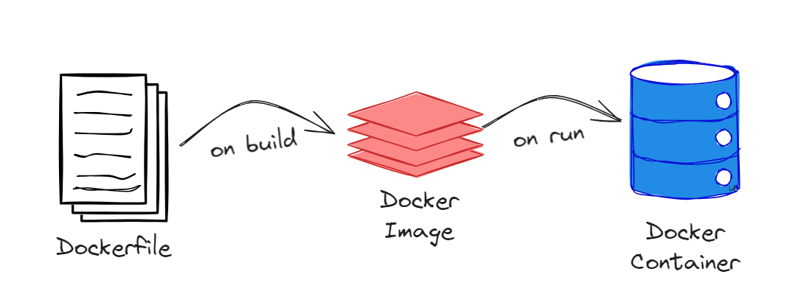

# Overview:

### Module 1: Introduction to Docker, Terraform and GCP
***

**Docker**: Docker is a containerization platform which is used to deliver software in packages called containers.

Docker Commands: 
* -rm : remove
* -i  : interactive mode
* -r : recursive
* docker run : run a container
* docker build : builds the image from the dockerfile

How a docker container is built?



Docker containers are stateless meaning any data stored is lost when they are restarted or stopped. We should rely on external sources to store persisitent information. 

For stateful applications we need to mount volumes from host machine to container or use external databases.


**Create a dummy pipeline**
***

The pipeline.py file contains a python script that accepts a system argument day and prints it using the print statement. 


**Write a dockerfile to build a docker image**
***

A dockerfile does not have an extension and we name it "dockerfile". This file contains the required set of commands to build a docker container.

To build the image from the file we use:

```ssh
docker build -t test:pandas .
```

test  - image name

pandas - tag (default is latest)

.(period) - represents the current directory as the build context, tells Docker to use the current directory as the source for building the Docker image.

Now the Dockerfile contains how to build the container.


**Run the container**:

***

```ssh
docker run -it test:pandas day_number
```

The ouput prints two lines:

* ['pipeline.py', '<day_number>']
* job finished successfully for the day of <day_number>

### Using Docker to run a Postgres container
***

We need to create a folder to store the database information because containers are stateless. We use volumes for this in this course.

Create a folder to allow postgres to store the data.

Run the postgres container by specifying certain variables as shown below:

```bash
winpty docker run -it \
    -e POSTGRES_USER="root" \
    -e POSTGRES_PASSWORD="root" \
    -e POSTGRES_DB="ny_taxi" \
    -v D:\\Technical\\DataTalks\\Data_Engineering_Zoomcamp\\docker\\ny_taxi_postgres_datadata:/var/lib/postgresql/data \
    -p 5432:5432 \
    postgres:13

```

### Connecting pg-admin and postgres
***
 ```bash
winpty docker run -it \
     -e PGADMIN_DEFAULT_EMAIL="admin@admin.com" \
     -e PGADMIN_DEFAULT_PASSSWORD="root" \
     -p 8080:80 \
     dpage/pgadmin4
```

Once the login page opens on the link http://localhost:8080/login, use the relevant details from above to login. Create a new server with a name, connection and save. This might throw an error as postgres and pgadmin are in two different containers and hence needs to be linked through a docker network to be able to communicate with each other.

### Connecting postgres and pgadmin via a docker network

Step 1: Run the postgres container in the network using the below additions to the previous command.

```bash
winpty docker run -it \
    -e POSTGRES_USER="root" \
    -e POSTGRES_PASSWORD="root" \
    -e POSTGRES_DB="ny_taxi" \
    -v D:\\Technical\\DataTalks\\Data_Engineering_Zoomcamp\\docker\\ny_taxi_postgres_datadata:/var/lib/postgresql/data \
    -p 5432:5432 \
    --network=pg-network \
    --name pg-database \
    postgres:latest 
```

Step 2: Run the pgadmin container in the same network.

```bash

winpty docker run -it \
    -e PGADMIN_DEFAULT_EMAIL="admin@admin.com" \
    -e PGADMIN_DEFAULT_PASSWORD="root" \
    -p 8080:80 \
    --network=pg-network \
    --name pg-admin1 \
    dpage/pgadmin4

``` 
